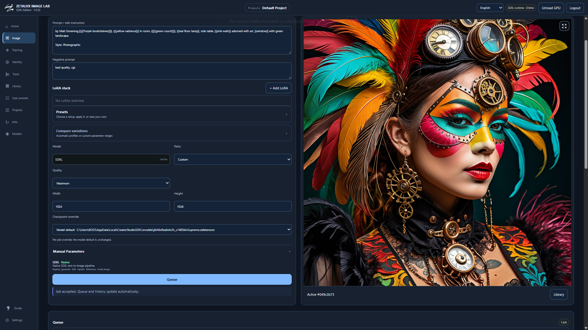
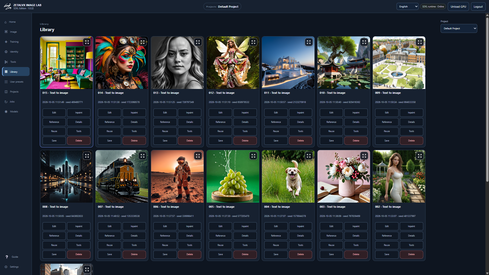

# Zetalvx Image Lab — SDXL Edition

**Zetalvx Labs**

*Local SDXL generation, editing, training, Identity and Vision workspace.*

> **Source distribution.** This repository contains the application
> source code. It does not bundle AI model weights, datasets,
> credentials, NVIDIA/CUDA drivers, FFmpeg binaries or prebuilt Python
> environments.

**License:** Apache-2.0 for the application source.

## Overview

**Zetalvx Image Lab --- SDXL Edition** is a local, browser-based
workspace built around Stable Diffusion XL.

The browser provides the interface while image generation, training and
optional AI services run locally on the host. The goal is to keep the
main SDXL workflow in one application: generation, editing, models,
datasets, training, Identity, Vision, projects and asset management.

### Main capabilities

-   SDXL text-to-image generation
-   Image-to-image
-   Inpainting and masked editing
-   Multiple SDXL checkpoints
-   LoRA loading and stacking
-   Reusable user presets
-   Parameter testing and comparison workflows
-   Dataset creation and management
-   Vision-assisted captioning
-   SDXL LoRA training
-   InstantID / Face Consistency
-   Face Swap with optional SDXL refinement
-   Projects and image library
-   Job queues and history
-   Image/media utilities
-   Local and trusted-LAN access over HTTPS
-   Diagnostic logs and runtime controls

No AI model weights are included in this repository.

<p align="center">

  

  

</p>
------------------------------------------------------------------------

## Image generation & editing

The **Image** workspace supports the main SDXL workflows:

-   Text-to-Image
-   Img2Img
-   Inpainting
-   Checkpoint selection
-   Compatible LoRAs
-   Generation parameters
-   Saved user presets
-   Parameter tests
-   Generation history
-   Project-based asset management

Generated images can be reused from the library together with their
settings instead of being tied only to the current browser session.

------------------------------------------------------------------------

## Model management

The **Models** workspace provides a central place for SDXL components.

You can:

-   configure the main SDXL checkpoint;
-   add additional checkpoints;
-   link compatible models already stored on the host;
-   manage compatible LoRAs;
-   reuse external model directories without unnecessarily duplicating
    files;
-   use the available Hugging Face / Civitai integrations where
    supported.

Model weights are not included in this repository.

> Loading a model in Zetalvx Image Lab does not grant additional rights
> to that model. Always check the license of the exact checkpoint, LoRA
> or component you use.

------------------------------------------------------------------------

## Datasets & LoRA training

The **Training** workspace includes:

-   dataset creation and management;
-   image and caption inspection;
-   trigger-word configuration and placement;
-   Vision-assisted caption generation;
-   CLIP-aware caption validation;
-   SDXL LoRA training;
-   live progress;
-   training history;
-   supported continuation/resume workflows.

### Vision captions and CLIP

Vision uses a concise default instruction designed to generate useful
SDXL training captions while normally remaining comfortably within the
SDXL CLIP context.

The Vision instruction can be customized by the user and restored to the
application default.

Before training, captions are still checked against the SDXL CLIP
context limit as a final safety layer. The original saved caption
remains preserved even when the encoder-facing training representation
has to be shortened.

------------------------------------------------------------------------

## Identity & Face workflows

Optional Identity workflows include:

-   InstantID / Face Consistency;
-   Txt2Img and Img2Img Identity generation;
-   primary subject-face reference;
-   optional base image;
-   optional face-landmark / pose reference;
-   selectable SDXL checkpoint;
-   compatible LoRAs where applicable;
-   Face Swap;
-   optional SDXL post-refinement;
-   Identity presets;
-   parameter testing.

Reference inputs have separate roles.

The **subject face** defines identity. Depending on the selected
workflow, the optional base and pose/landmark inputs provide the
corresponding composition or face-landmark guidance.

Identity and face-analysis components may have licenses different from
the Apache-2.0 application license. See [Licensing and model
terms](#licensing-and-model-terms).

------------------------------------------------------------------------

## Vision

Vision can be used for dataset captioning and related image-analysis
workflows.

Supported configurations include:

-   local GGUF models through `llama.cpp`;
-   local Transformers models;
-   explicitly configured API backends.

When requested, the application can prepare a supported managed
`llama.cpp` runtime. That runtime is downloaded separately and is not
bundled with this repository.

------------------------------------------------------------------------

## Projects, library & jobs

Zetalvx Image Lab also provides:

-   project management;
-   generated-image library;
-   reusable settings and presets;
-   current and previous jobs;
-   queues for supported workflows;
-   authenticated local downloads;
-   model linking;
-   image/media tools;
-   FFmpeg-based utilities where configured;
-   runtime status;
-   GPU unload controls;
-   local/LAN configuration;
-   diagnostic logs.

------------------------------------------------------------------------

# Interface

The main application areas include:

  Section            Purpose
  ------------------ --------------------------------------------
  **Home**           Main dashboard and application status
  **Image**          Generate, Img2Img and Inpaint
  **Training**       Datasets, captions and SDXL LoRA training
  **Identity**       InstantID, Face Consistency and Face Swap
  **Media Tools**    Image/media utilities
  **Library**        Generated and imported assets
  **User Presets**   Reusable configurations
  **Projects**       Project organization
  **Jobs**           Current and previous jobs
  **Models**         Checkpoints, LoRAs and model configuration
  **Guide**          Built-in application documentation
  **Settings**       Runtime, network and application settings

The interface is responsive and can also be accessed from another device
on the same trusted local network.

------------------------------------------------------------------------

# Source build vs packaged builds

There are two ways to use Zetalvx Image Lab.

  -----------------------------------------------------------------------
  Distribution                        Intended use
  ----------------------------------- -----------------------------------
  **GitHub Source**                   Manual installation for developers,
                                      contributors and users who want
                                      direct access to the source code

  **Packaged Linux / Windows builds** Separately distributed builds with
                                      a prepared installation and
                                      application lifecycle
  -----------------------------------------------------------------------

The GitHub source version does **not** create:

-   a global system command;
-   desktop shortcuts;
-   Windows services;
-   registry entries;
-   global Python environments.

The Source build runs from the checkout and deliberately keeps its
application data separate from packaged installations.

## Default Source data directory

### Linux

``` text
~/.local/share/CreatorStudioSDXL-Source
```

### Windows

``` text
%LOCALAPPDATA%\CreatorStudioSDXL-Source
```

> Do not point the Source build at the data directory of a packaged
> installation.

------------------------------------------------------------------------

# Requirements

## Common requirements

-   64-bit operating system
-   **Python 3.11 64-bit**
-   Modern web browser
-   Internet connection during dependency installation
-   Sufficient disk space for Python environments and the models you
    choose to install

Python must already be installed before following the Source
installation guide.

The Source setup does not modify your system Python installation.

## NVIDIA GPU

The documented NVIDIA configuration uses the `cu126` PyTorch package
backend.

You need:

-   a compatible NVIDIA GPU;
-   a working NVIDIA driver already installed on the host;
-   sufficient VRAM for the selected model, resolution and workflow.

The Source setup does **not** install or replace your NVIDIA driver or a
global CUDA toolkit.

A CPU dependency route can be used for setup/testing, but CPU execution
is not presented as a practical SDXL performance target.

AMD/ROCm and macOS are currently not documented as supported
configurations.

------------------------------------------------------------------------

# Installation

Detailed platform-specific instructions are included in the repository:

-   **Linux:** [`docs/INSTALL_LINUX.md`](docs/INSTALL_LINUX.md)
-   **Windows:** [`docs/INSTALL_WINDOWS.md`](docs/INSTALL_WINDOWS.md)

## Linux quick start

Run the installation from the repository root containing `source.py`.

First verify Python 3.11:

``` bash
python3.11 --version
```

The Source installation creates isolated application and SDXL
environments under the Source data directory.

After completing the Linux installation guide:

``` bash
data="$(python3.11 source.py home)"
"$data/runtime/app/bin/python" source.py start --local
```

Then open:

``` text
https://127.0.0.1:8298
```

## Windows quick start

Extract the repository to a normal writable directory.

Open **PowerShell as your normal user** in the repository directory and
verify Python:

``` powershell
py -3.11 --version
```

After completing the Windows installation guide:

``` powershell
$data = (& py -3.11 source.py home | Out-String).Trim()
$app = Join-Path $data 'runtime\app\Scripts\python.exe'

& $app source.py start --local
```

Then open:

``` text
https://127.0.0.1:8298
```

Administrator privileges are not required for the normal Source
installation.

------------------------------------------------------------------------

# First setup

On the first launch, Zetalvx Image Lab asks you to create the local
account.

The application uses HTTPS with a locally generated self-signed
certificate.

Because the certificate is local, your browser may display a certificate
warning when connecting for the first time.

For local use:

``` text
https://127.0.0.1:8298
```

No default application password is included.

------------------------------------------------------------------------

# Models

The repository does not contain SDXL model weights.

Existing compatible model files can be linked through the application.

Standard Source data locations include:

``` text
models/
├── SDXL/
├── loras/
│   └── SDXL/
└── Identity/
```

To prepare the SDXL configuration/tokenizer files:

``` text
source.py download-configs
```

An optional explicit SDXL Base download is available after accepting the
corresponding model license:

``` text
source.py download-base --accept-license
```

You can also configure your own compatible checkpoints through the
**Models** interface.

------------------------------------------------------------------------

# Identity setup

The Source contains the application integration but does not bundle all
Identity model weights.

The supported InstantID code integration can be prepared with:

``` text
source.py identity-code
```

Identity, InsightFace and Face Swap components can have licensing
conditions different from the application itself.

Always verify the terms of the exact models and components you install.

------------------------------------------------------------------------

# Local & LAN access

## Local mode

Local mode is intended for use from the host running the application.

``` text
source.py network local
source.py start --local
```

Default local address:

``` text
https://127.0.0.1:8298
```

## LAN mode

Zetalvx Image Lab can also be accessed from another device on the same
trusted local network.

Stop the application before changing network mode.

``` text
source.py stop
source.py network lan
source.py start --no-browser
source.py setup-code
```

The application displays the HTTPS LAN address.

Open that address from the other device and use the temporary setup code
when creating the first account.

> The setup code is for first-account creation. It is not the normal
> login password and does not reset an existing account.

Do not expose the application or its worker ports directly to the public
Internet.

To return to local-only access:

``` text
source.py stop
source.py network local
source.py start --local
```

------------------------------------------------------------------------

# Source commands

Source operations are performed through `source.py`.

For normal use, run these commands with the Python interpreter created
inside the Source application environment, as described in the
installation guides.

  --------------------------------------------------------------------------------
  Command                                      Purpose
  -------------------------------------------- -----------------------------------
  `source.py home`                             Show the isolated Source data
                                               directory

  `source.py init`                             Initialize Source configuration and
                                               local HTTPS

  `source.py start --local`                    Start in local-only mode

  `source.py start --no-browser`               Start without opening a browser

  `source.py stop`                             Stop processes owned by this Source
                                               instance

  `source.py status`                           Show current application status

  `source.py doctor`                           Run environment/runtime diagnostics

  `source.py network local`                    Configure local-only access

  `source.py network lan`                      Configure trusted-LAN access

  `source.py setup-code`                       Generate/rotate the temporary
                                               first-account setup code

  `source.py password`                         Reset account credentials from the
                                               host CLI

  `source.py download-configs`                 Prepare SDXL
                                               configuration/tokenizer files

  `source.py download-base --accept-license`   Explicitly download SDXL Base after
                                               license acceptance

  `source.py identity-code`                    Prepare the supported InstantID
                                               code integration
  --------------------------------------------------------------------------------

------------------------------------------------------------------------

# Logs & troubleshooting

Logs are stored under:

``` text
<source-home>/shared/logs
```

Important logs include:

``` text
launcher.log
web-worker.log
image-worker.log
training-worker.log
identity-worker.log
app-control.log
```

Useful diagnostic commands:

``` text
source.py status
source.py doctor
```

## Generation problems

Check:

-   selected SDXL checkpoint;
-   model path;
-   runtime status;
-   GPU availability;
-   available VRAM;
-   `image-worker.log`.

## Training problems

Check:

-   dataset contents;
-   captions;
-   trigger configuration;
-   selected model;
-   available disk space and VRAM;
-   `training-worker.log`.

## Identity problems

Check:

-   selected SDXL checkpoint;
-   required Identity/face components;
-   reference images;
-   Identity runtime status;
-   `identity-worker.log`.

## Vision / GGUF problems

If a local GGUF Vision backend fails, inspect the Vision/runtime log
before replacing models or runtimes.

Verify that the GGUF and its corresponding multimodal projector are
compatible with each other and with the selected runtime.

> Logs can contain local paths or user data. Remove credentials, tokens
> and other sensitive information before posting logs publicly.

------------------------------------------------------------------------

# Updating the Source checkout

Before moving to a newer Source revision:

1.  finish or cancel active jobs;
2.  stop the application;
3.  back up important user data;
4.  download or pull the new Source revision;
5.  read the release notes;
6.  update dependencies only when required;
7.  continue using the same **Source** data directory.

Changing the Git checkout does not automatically roll back user data,
models or schema changes.

The automatic ZIP updater used by packaged builds is not intended for
Source releases.

------------------------------------------------------------------------

# Removing the Source installation

First stop the application:

``` text
source.py stop
```

Then remove the repository checkout.

Application data is stored separately, so deleting the repository does
**not** automatically delete:

-   models;
-   datasets;
-   generated images;
-   projects;
-   presets;
-   configuration;
-   account data.

Delete the Source data directory separately only when you are sure those
files are no longer needed.

Externally linked model directories are independent and should not be
recursively deleted with the application data.

------------------------------------------------------------------------

# Security

Zetalvx Image Lab is designed primarily for local or trusted-LAN use.

Recommended practices:

-   keep the application and dependencies updated;
-   use a strong local password;
-   do not expose worker ports;
-   do not directly publish the local server to the Internet;
-   keep model/API credentials private;
-   review logs before sharing them;
-   use models and files only from sources you trust.

For security information and vulnerability reporting, see:

[`SECURITY.md`](SECURITY.md)

------------------------------------------------------------------------

# Licensing and model terms

The **Zetalvx Image Lab application source** is distributed under the
**Apache License 2.0**.

See:

-   [`LICENSE`](LICENSE)
-   [`NOTICE`](NOTICE)
-   [`THIRD_PARTY_NOTICES.md`](THIRD_PARTY_NOTICES.md)
-   [`docs/MODELS_AND_LICENSES.md`](docs/MODELS_AND_LICENSES.md)
-   [`docs/ATTRIBUTION_AND_LICENSES.md`](docs/ATTRIBUTION_AND_LICENSES.md)

The application license does not replace the licenses of third-party
components or model weights, including:

-   SDXL and other checkpoints;
-   LoRAs;
-   InstantID weights;
-   InsightFace pretrained models;
-   Face Swap models;
-   Vision models;
-   `llama.cpp`;
-   FFmpeg;
-   user-provided datasets or media.

The fact that a model can be loaded by the application does not imply
permission for every use, redistribution or commercial scenario.

Always review the terms of the exact model or component you choose to
install.

------------------------------------------------------------------------

# Documentation

Detailed documentation is included in the repository:

-   [Linux installation](docs/INSTALL_LINUX.md)
-   [Windows installation](docs/INSTALL_WINDOWS.md)
-   [Source operation](docs/SOURCE_OPERATION.md)
-   [Models and licenses](docs/MODELS_AND_LICENSES.md)
-   [Testing](docs/TESTING_SOURCE.md)
-   [Source boundaries](docs/SOURCE_BOUNDARY.md)
-   [Security](SECURITY.md)
-   [Contributing](CONTRIBUTING.md)

------------------------------------------------------------------------

# Contributing

Contributions, bug reports and technical feedback are welcome.

Before submitting changes, read:

[`CONTRIBUTING.md`](CONTRIBUTING.md)

For bug reports, include where relevant:

-   operating system;
-   GPU and driver information;
-   Python version;
-   affected workflow;
-   exact error;
-   relevant sanitized log section;
-   steps required to reproduce the problem.

Do not include passwords, API keys, access tokens or private model
credentials.

------------------------------------------------------------------------

# Zetalvx Labs

**Zetalvx Image Lab --- SDXL Edition** is part of the **Zetalvx Labs**
software family.

The family is designed to host separate tools and editions for different
local AI workflows while keeping each application focused on its own
model family and use case.
